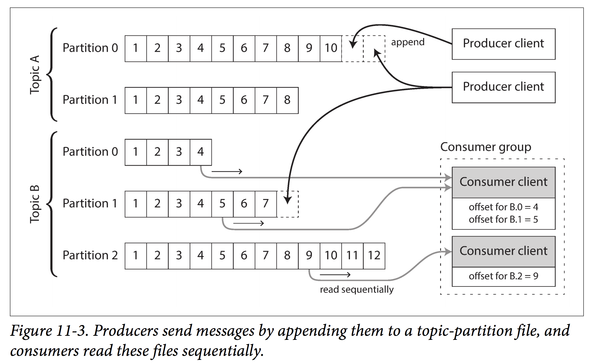

Chapter 11 - Stream Processing
===
---
<!-- page_number: true -->

# Problem with batch processing

**Issues:**
- Batch process assumes that input is bounded (data is known and finite size), in reality, data comes in gradually over time.
- Batch processing delays

**Agenda**
- How event streams are represented, stored, and transimitted
- Relationship between databases and streams
- Approaches and tools to process streams continuously
- Ways to use these to build applications

---

# Transmitting Event Streams

- **event**: a small, selfcontained, immutable object containing the details of something that happened at some point in time
- **producer/publisher/sender** generates an event once and the event gets processed by multiple **consumers/subscribers/recipients**
- related events are grouped into a **topic/stream**

---

# Messaging Systems
- **Direct Message**: unix pipe, TCP connection
- **Message Brokers** 
- **Partitioned Logs** 

**How to choose messaging systems?**

- What happens if the producers send messages faster than the consumers can proess them? **Options:** drop message, buffer messages, back pressure/flow control
- What happens if nodes crash or temporarily go offline. are any messages lost? **Options:** durability or higher thourghput with potential message lost

---

# Direct Message
**Examples**
- UDP multicast: stock market feed (low latency, use application to recover data if lost)
- UDP: StatsD, Brubeck?
- Http or RPC: webhooks

**Pros**
- synchronous processing

**Cons**
- if consumer is offline?
- limited fault tolerance
---

# Message Broker / Message Queue
**Examples**
- Pub / Sub
- JMS, ActiveMQ, RabbitMQ

**Pros**
- Duability in broker
- Consumer can come and go
- unbounded queueing
- parallel processing
- Acknowledgements and redelivery

**Cons**
- Async processing
- Should be idempotent, otherwise need to deal with causal dependencies
---
# Partitioned Logs - Log-based message broker
**Pros**
- Durable storage and fault tolerent by replicating messages
- High performance though partitioning across multiple machines for fast-to-process messages and eliminating the needs to track consumers' ACK
- Replay messages

**Cons**
- Not a good solution for load balancing (1 parition to 1 consumer)
- If single message processing time is long, it could hold up the processing of subsequent messages in that partition
- Potential dropping msgs: delete or archive msgs to reclaim disk space leads to certain consumer missing messages

---
# Partitioned Logs Example
- Kafka, Amazon Kinesis, Twitter's DistributedLog

---
# Change data capture (CDC)
Observing all data changes written to a database and extracting them in a form in which they can be replicated to other systems. 

One leader and turn all other systems into async followers
**Example:** Linkedin Databus, FB's wormhole, Yahoo's Sherpa and many other implementation

---
# CDC - details

- **Initial snapshot** to create follower database (snapshot + log offset)
- **Log compaction:** use hash indexes to keep the most recent value for every key (Apache Kafka supports this)
- **API support for change stream:** Application to subscribe to data changes
---
# Event Sourcing v.s. CDC
- **CDC**: application is not aware and the log of changes is extracted at a low level. CDC only keeps the most recent value of a key.
- **Event Sourcing**: app is built on the basis of immutable events writen to an event log and event store is append only. application transforms events logs to application states for user usage. Event captures user intent and might not the state update. App needs the full history to calculate the correct app state. App uses this usually have mechanisms to store snapshots for performance optimization purpose.
---
# State, Stream, Immutability
- **State**: integrate an event stream over time
- **Stream**: differentiate the state by time
- **Immutable Events**: auditability, reproducibility
- **CQRS**: Command Query Responsibility Segregation -> you can translate data from a write-optimized event log to read-optimized application state
---
# Downside of event sourcing and CDC
Consumers of the event log are async, there will be delays between read and write. 
*Solution:* Distributed transaction, but atomic operation is easier with event sourcing and CDC since it only needs to append to the event log	

Good for workloads with mostly add and rarely update/delete. High rates of updates/deletes on small datasets will make event logs not peforming

---

# Processing Streams
- Store stream data, send notifications, produce output streams
Use case: Fraud detection, trading, activity monitoring and tracking

- **Complex event processing (CEP):** high-level declarative query language like SQL to describe patterns of events that should be detected. Queries are stored long term and events from the input stream flow past queries to generate output. (Esper, Apama, SQLstream)
- **Stream Analytics:** toward aggregation and statistical metrics (Apache Storm, Spark streaming ...)
- **Materialized View:** deriving an alternative view onto some dataset so that you can query it efficiently, and updating that view whenever the underlying data changes

- **Search on streams: Media monitoring - reverse search** 
https://www.elastic.co/blog/percolator

---
# Processing Streams

- **Event time versus processing time:** Message delays leads to unpredictable ordering of messages
- **Knowing when you’re ready:** How do you know you have received all the messages for the minute? options: ignore all *straggler* events, publish a *correction*, each producer use a special message to indicate "no more messages with a timestamp earlier than t. 
- **What clocks do you use?** store three timestamps: device time when event occured, device time when event was sent to server, server time when the event was received by the server
___
# Processing Streams (cont.d)

- **Types of windows:** 
	- Tumbling window: fixed length. one min window. 
	- Hopping window: fixed length with overlap to provide smoothing. a 5-minute window with a hop size of 1 minute would contain the events between 10:03:00 and 10:07:59, then the next window would cover events between 10:04:00 and 10:08:59
	- Sliding window: contains all the events that occur within some interval of each other. For example, a 5-minute sliding window would cover events at 10:03:39 and 10:08:12.
	- Session window: no fixed duration. all events for the same users that occur closely together in time.
	
___
# Stream Joins

Three types of joins: 

- stream-stream joins
- stream-table joins
- table-table joins
___

# Stream Joins - stream-stream joins (window join)

Example: to evaluate search click-through rates.

Stream processor needs to maintain state: for example, all the events that occurred in the last hour, indexed by session ID. Whenever a search event or click event occurs, it is added to the appropriate index, and the stream processor also checks the other index to see if another event for the same session ID has already arrived. If there is a matching event, you emit an event saying which search result was clicked. If the search event expires without you seeing a matching click event, you emit an event saying which search results were not clicked.
___
# Stream Joins - stream-table joins (stream enrichment)

Example: user activity analysis - associate user info with user activity events

- one activity at a time. stream processor queries remote database or keep a local copy of the data and subscribe to the db changelog to get updates

___

# Stream Joins - Table-table join (materialized view maintenance)

Example: twitter timeline (add/delete/follow/unfollow), we want a timeline cache: a kind of per-user “inbox” to which tweets are written as they are sent, so that reading the timeline is a single lookup

- The join of the streams corresponds directly to the join of the tables in that query. The timelines are effectively a cache of the result of this query, updated every time the underlying tables change.

___

# Stream Joins - Time-dependence of joins
Example: tax rate changes, user profile changes, which records to join (new or old ones). how to keep the join deterministic? ->  slowly changing dimension (SCD)

- using a unique identifier for a particular version of the joined record: for example, every time the tax rate changes, it is given a new identifier
___

# Fault Tolerance

In batch processing, effectively-once principle to apporach fault tolerance.

In stream processing:
- Microbatching: Spark Streaming: batch size of one sec. implicitly provides a tumbling window of one sec
- checkpointing: Apache Flink: periodically generate rolling checkpoints of state and write them to durable storage and can restart from its most recent checkpoint.
- Distributed Transactions
- Idempotence
- Write to durable storage so that it could use to resume the operations
___
Chapter 12 - The Future of Data Systems
===
---
# Tooling
Data Integration and Combining Specialized Tools by Deriving Data 
- to figure out the mapping between the software products and the circumstances in which they are a good fit

---

# Derived data versus distributed transactions
- Distributed transactions: decide on an ordering of writes by using locks / atomic commit for mutual exclusion (linearizability)

- Derived data(CDC and event sourcing) use a log for ordering and base on deterministic retry and idempotence

- XA has poor fault tolerance and performance characteristics. because of lack of widespread support for a good distributed transaction protocol, log-based derived data is the most promising approach. (**eventual consistency** is the problem!)

Derived views allow gradual evolution. If you want to restructure a dataset, you do not need to perform the migration as a sudden switch. Instead, you can maintain the old schema and the new schema side by side as two independently derived views onto the same underlying data.

---

# The lambda architecture

Incoming data should be recorded by appending immutable events to an always-growing dataset, similarly to event sourcing. 

From these events, read-optimized views are derived. 

Running two different systems in parallel: a batch processing system such as Hadoop MapReduce, and a separate streamprocessing system such as Storm.

Benefits: the stream process can use fast approximate algorithms while the batch process uses slower exact algorithms.

Drawbacks: Complexity of merging/debugging/tuning/maintaining two paralllely runing systems. 

---

# Unifying batch and stream processing

Requires the following:
- replay historical events through the same processing engine that handles the stream of recent events (ie. log-based MQ)
- Exactly-once semantics for stream processors
- Tools for windowing by event time

---
# Composing data storage technologies

- Unbundling database - database v.s. Unix
- Creatin an Index
- Materialized Views
- Replication logs
- Full text Search

Two approaches:
- Federated databases / polystore: unifying reads (ie. Postgresql [foreign data wrapper](https://thoughtbot.com/blog/postgres-foreign-data-wrapper))
- Unbundled databases: unifying writes: author proposed not using distributed transactions across heterogeneous storage systems. **we should use ordered log of events with idempotent consumers**

---
# Unbundled databases

the goal is to allow you to combine several different databases in order to achieve good performance for a much wider range of workloads than is possible with a single piece of software.

**System:**
- better fault tolerence
- loose coupling

**Human:**
- allows different software components and services to be developed from different teams

---
# Designing Applications Around Dataflow - "database inside-out"

- Stateless application with mutable shared variables (database)
- Change subscription is just begining to emerge as a feature: Stable message ordering and fault-tolerant message processing are required at the application level

---
# Microservices v.s. dataflow

1. In the microservices approach, the code that processes the purchase would probably query an exchange-rate service or database in order to obtain the current rate for a particular currency.
2. In the dataflow approach, the code that processes purchases would subscribe to a stream of exchange rate updates ahead of time, and record the current rate in a local database whenever it changes. When it comes to processing the purchase, it only needs to query the local database. (will need to handle the time dependency)

---
# Observing Derived State

- Materialized views and caching (most frequent queries cache)
- Stateful, offline-capable clients (mobile, browser local storage)
- Pushing state changes to clients (web sockets)
- Reads are events?: Recording a log of read events potentially also has benefits with regard to tracking causal dependencies and data provenance across a system

---
# End-to-End Argument for Databases

how to make sure applications are free of data loss or corruption.

- Transactions?: commit or abort at the database level. might not enough.
- end to end arguments: have request id and/or checksum from client to database
- fault-tolerance abstractions?

---
# Enforcing Constraints

- Uniqueness constraints require consensus
	- single leader
	- partitioning
	- multi master replication will not work
- log based messaging?
	- if the log is partitioned based on the value that needs to be unique, stream processing could be unique

---
# Multi-partition request processing with log based messaging and no atomic commit

1. The request to transfer money from account A to account B is given a unique request ID by the client, and appended to a log partition based on the request ID.
2. A stream processor reads the log of requests. For each request message it emits two messages to output streams: a debit instruction to the payer account A (partitioned by A), and a credit instruction to the payee account B (partitioned by B). The original request ID is included in those emitted messages.
3. Further processors consume the streams of credit and debit instructions, deduplicate by request ID, and apply the changes to the account balances.

Discussion: Step 1, 2, 3 crashed? 

---
# Consistency = Timeliness and Integrity

- Integrity is much more important than timeliness
- event-based dataflow systems decouples timeliness and integrity
- dataflow systems achieve intergrity via:
	- Representing the content of the write operation as a single message, which can easily be written atomically
	- Deriving all other state updates from that single message using deterministic derivation function
	- Passing a client-generated request ID through all these levels of processing, enabling end-to-end duplicate suppression and idempotence
	- Making messages immutable and allowing derived data to be reprocessed from time to time, which makes it easier to recover from bugs
	- provide better auditability
